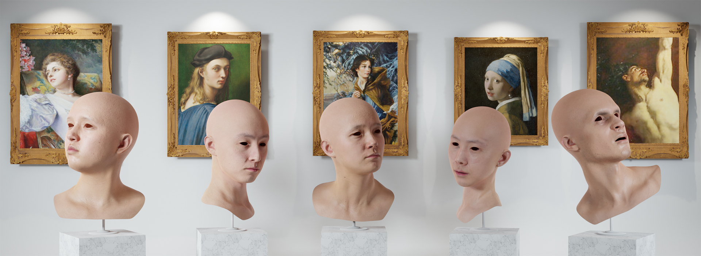
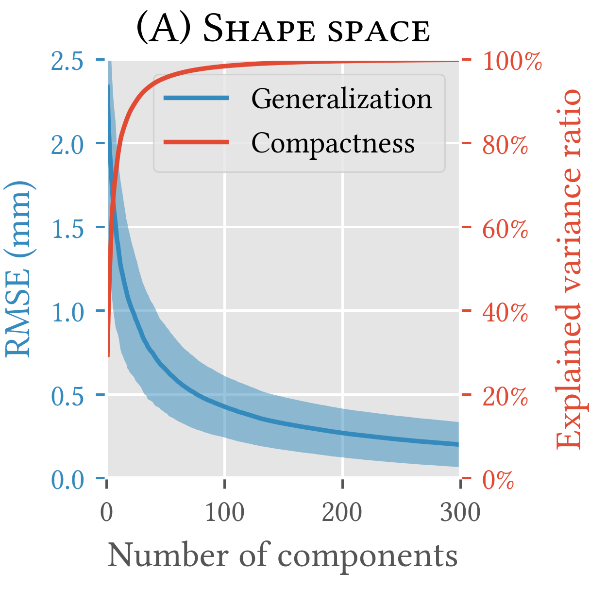
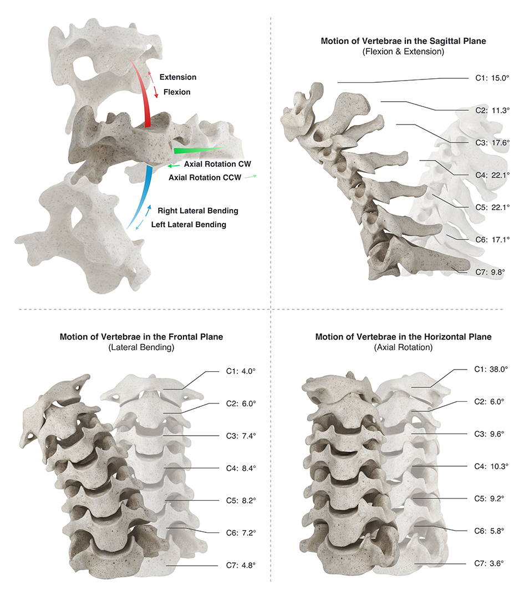
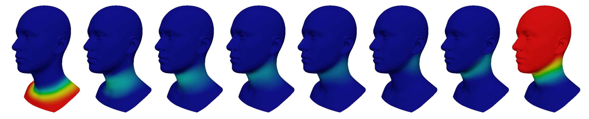

# HACK


HACK (Head-And-neCK) is a novel parametric model for constructing the head and cervical region of digital humans. It aims to disentangle the full spectrum of neck and larynx motions, detailed facial expressions as well as appearance variations, offering more personalized and anatomically consistent controls that are compatible with CG engines. 


| Feature                | Ready              |
| ---------------------- | ------------------ |
| Template mesh          | :heavy_check_mark: |
| Skeleton joints        | :heavy_check_mark: |
| Skinning weights       | :heavy_check_mark: |
| Larynx operation       | :heavy_check_mark: |
| Shape blendshapes      | :heavy_check_mark: |
| Expression blendshapes | :heavy_check_mark: |
| Pose blendshapes       | :heavy_check_mark: |
| Blendshapes space      | :soon:             |
| PyTorch module         | :heavy_check_mark: |
| Texture basis          | :soon:             |

## HACK (Head-And-neCK) Model
The HACK Model consists of a base topology along with definitions of facial landmarks, shape blendshapes, expression blendshapes, cervical joints, and pose blendshapes.

### Face Model Topology
HACK uses the same facial topology as [ICT-FaceKit](https://github.com/ICT-VGL/ICT-FaceKit), including 14062 vertices and 14034 quad faces.

| Ordinal# | Geometry name    | Vertex range         | Polygon range        | #Vertices | #Faces |
| -------- | ---------------- | -------------------- | -------------------- | --------- | ------ |
| n/a      | All              | `range(0,14062)    ` | `range(0,26384)    ` | 26719     | 26384  |
| #0       | Face             | `range(0,9409)     ` | `range(0,9230)     ` | 9409      | 9230   |
| #1       | Head and Neck    | `range(9409,11248) ` | `range(9230,11144) ` | 1839      | 1914   |
| #2       | Mouth socket     | `range(11248,13294)` | `range(11144,13226)` | 2046      | 2082   |
| #3       | Eye socket left  | `range(13294,13678)` | `range(13226,13630)` | 384       | 404    |
| #4       | Eye socket right | `range(13678,14062)` | `range(13630,14034)` | 384       | 404    |

### Face Area Details
| Ordinal# | Geometry name    | Vertex range    | Polygon range   | #Vertices | #Faces |
| -------- | ---------------- | --------------- | --------------- | --------- | ------ |
| #0       | Full face area   | `range(0,9409)` | `range(0,9230)` | 9409      | 9230   |
| #1       | Narrow face area | `range(0,6706)` | `range(0,6560)` | 6706      | 6560   |


### Facial Landmarks
HACK shares the same Multi-PIE 68 point facial landmarks indices as [ICT-FaceKit](https://github.com/ICT-VGL/ICT-FaceKit):
`[1225, 1888, 1052, 367, 1719, 1722, 2199, 1447, 966, 3661, 4390, 3927, 3924, 2608, 3272, 4088, 3443, 268, 493, 1914, 2044, 1401, 3615, 4240, 4114, 2734, 2509, 978, 4527, 4942, 4857, 1140, 2075, 1147, 4269, 3360, 1507, 1542, 1537, 1528, 1518, 1511, 3742, 3751, 3756, 3721, 3725, 3732, 5708, 5695, 2081, 0, 4275, 6200, 6213, 6346, 6461, 5518, 5957, 5841, 5702, 5711, 5533, 6216, 6207, 6470, 5517, 5966]`


### Expression blendshapes
HACK Model includes 55 expression blendshapes, which have the same definition from [ICT-FaceKit](https://github.com/ICT-VGL/ICT-FaceKit).
> Current expression shapes adopt the naming convention of the Apple ARKit, but with "Left" and "Right" specified with "_L" and "_R". Additionally, we separeate the shapes (browInnerUp_L and browInnerUp_R), and (cheekPuff_L and cheekPuff_R).


### Shape blendshapes
HACK Model includes a set of 200 PCA blendshapes of HACK shape space. 




### Joints
HACK Model includes 8 joints corresponding to the bottom points of 7 vertebrae (C1-C7) and the apex of C1. This setup yields 8 bone transformations denoted as c7-t1, c6-c7, c5-c6, c4-c5, c3-c4, c2-c3, c1-c2,
and o-c1.



### Skinning weights
HACK Model includes skinning weights corresponding to 8 rotation joints in the cervical spine.



### Pose blendshapes
HACK **Model** includes 72 pose blendshapes, whose weights are automatically set by the rotation of 8 joints.

## File Structure
```
HACK-Model
|-- data    # recorded data for demonstration
|-- model
|   |-- 000_generic_neutral_mesh_newuv.obj  # template mesh for larynx
|   |-- 000_generic_neutral_mesh.obj        # template mesh
|   |-- blendshape.npy                      # ICT-FaceKit expressions
|   |-- bones_neutral.json                  # template bone
|   |-- E.npy                               # expression blendshapes
|   |-- Lc_mid.png                          # template larynx shape
|   |-- P.npy                               # pose blendshapes
|   |-- S.npy                               # shape blendshapes
|   |-- ts_larynx.npy                       # template larynx shape
|   |-- weight_map_smooth.npy               # skinning weight
|-- examples.ipynb  # examples
|-- hack_model.py   # HACK model definition
|-- helper.py       # utils  
```

## Examples

### PyTorch model
See `examples.ipynb` for running examples.


### Blender model
Coming soon...

<!-- ## Publications -->

## Contact
If you have any questions, please send an e-mail to shanghaitechmars@foxmail.com